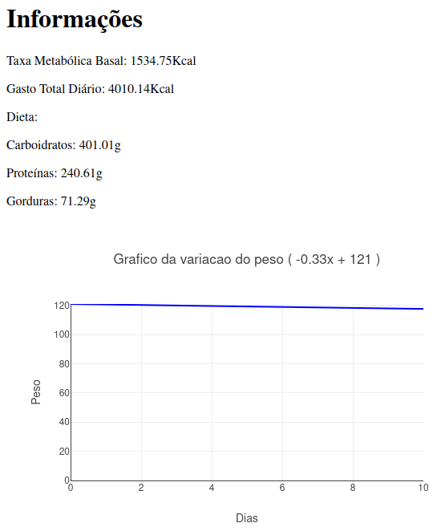

- Integrantes
  - Ivan Capeli Navas, 802286
  - Matheus Yuiti Moriy Miata, 802097
  - Vítor Milanez, 804319

---

Implementação de um compilador para a linguagem dietLang.

## O que é:
A linguagem dietLang tem como objetivo fornecer uma dieta ou plano alimentar especificando os macro nutrientes básicos e uma perspectiva de ganho ou perda de peso para uma pessoa, com base em suas características físicas, metas e rotina de treino.

### Regras da Linguagem
- Deve conter altura, peso, idade, sexo, objetivo;
- No mínimo 3 treinos;
- Cada treino deve conter no mínimo 5 exercícios;
- Os exercícios aeróbicos de todos os treinos devem somar 2 horas no mínimo;
- Não pode ter exercício repetido no mesmo treino;
- Os nomes dos treinos devem ser diferentes entre si.

### Exemplo da Linguagem em Ação
- Entrada:
``` 
Altura: 1.80
Peso: 121
Idade: 30
Sexo: Masculino
Objetivo: Emagrecer
#COMENTARIO
Treino A {
    Musculacao Peito
    Musculacao Triceps
    Aerobico Caminhada 20 min
    Aerobico Bicicleta 40 min
    Musculacao Ombro
}
Treino B {
    Musculacao Gluteo
    Musculacao Biceps Femoral
    Calistenia Abdominal
    Aerobico Eliptico 30 min
    Musculacao Ombro
}
Treino C {
    Musculacao Peito
    Musculacao Triceps
    Calistenia Antebraco
    Aerobico Luta 1 h
    Musculacao Ombro
}
```
- Saída:



```
Carboidratos: [Banana, Feijão, Arroz, Quinoa, Pêra]
Proteínas: [Salmão, Filé de frango, Leite]
Gorduras: [Queijo]
```

## Como Executar
- É necessário clonar o repositório:
``` bash
git clone https://github.com/matheusymm/compT6.git
```
- Na pasta do projeto, executar com o Maven:
``` bash
cd compT6/
mvn package
```
- Por fim, executar com a entrada fornecida ou alguma de sua preferência:
``` bash
java -jar ./target/dietLang-1.0-SNAPSHOT-jar-with-dependencies.jar ~/caminho-para-entrada ~/caminho-para-saida ~/caminho-para-cardapio 
```
**Obs.:** O `caminho-para-cardapio` é opcional.

**Link para video explicativo:** https://drive.google.com/file/d/1ijegDqTMx1fjBsa90mr3_NZt8e9RteGI/view